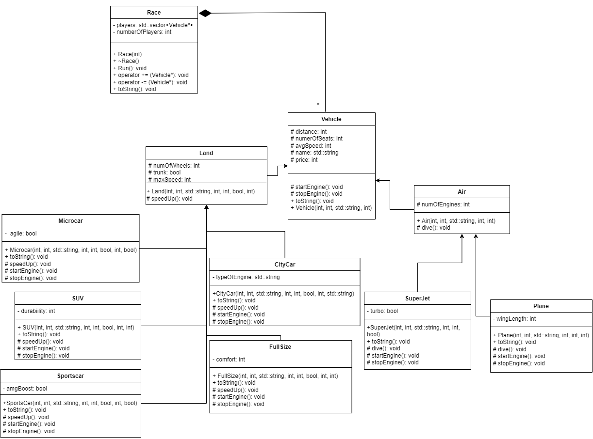

# Race Project

Author: addobosz

## Introduction

The following project was assigned to me during the object programming university course. That is why I have put such a strong emphasis on cornerstone concepts of this field - polymorphism, encapsulation, inheritance and abstraction. 
Having so many classes, I decided to split each of them into cpp and header files. Implementation of race varies depending on branch: **main** branch introduces race class written using cpp and header-file, while **template** branch displays equivalent features but using tpp file (instead of cpp).

For the sake of convienience, I recommend to take a look at the UML diagram that I have prepared for the purposes of this project: 

## Prerequisites

Project is written exclusively in c++, therefore basic compilers would suffice. When compiling version with race.tpp, please make sure that tpp files are supported by the chosen compiler.

## Installation:

In order to run the project I have used the following command:
```g++ *.cpp -o main && ./main```
